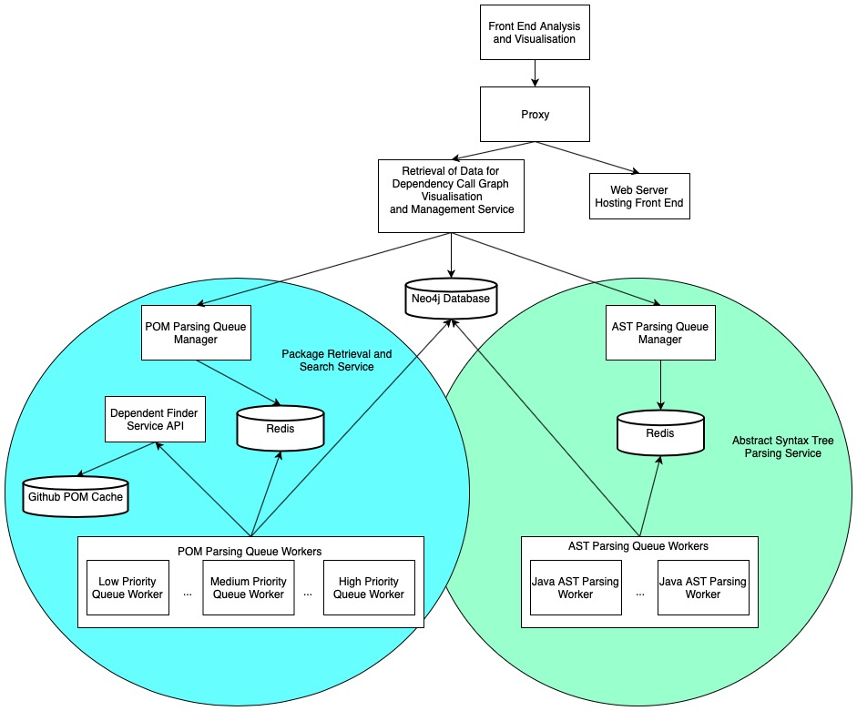
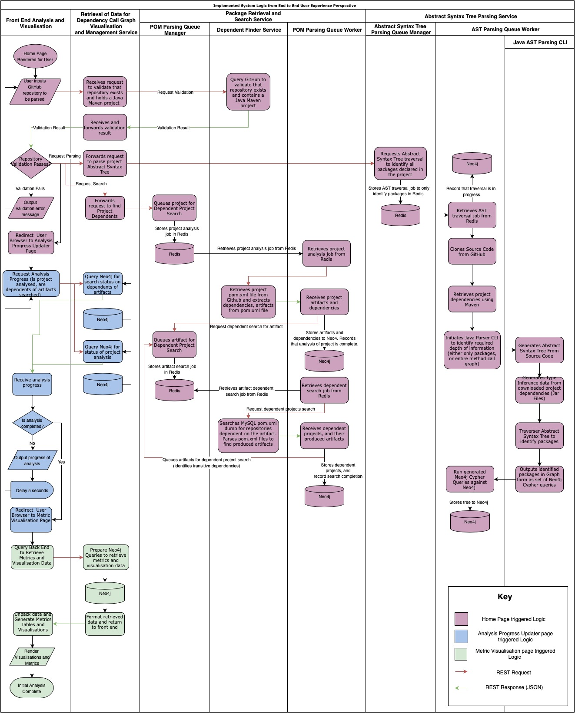

# Dependents Identification and Analysis Service

The produced application defined here allows a user to identify and analyse dependencies between open source repositories containing a Java project, built using Maven, and hosted on GitHub. Via a web based user interface, a user can specify the URL of a repository to be analysed. From this analysis, other public repositories hosted on Github dependent on artifacts produced by this repository will be identified; as well as transitively dependent repositories, and other information retrievable from from the pom.xml file of the repository (artifacts produced, project dependencies). This information is rendered to the user through a web interface, where the user can also request further analysis of the dependent repositories to identify which sections of a dependent repositories code base rely on the analysed repository at the method call level. Through visualisations, the user is able to explore these method call level dependencies.

To try out the application yourself, head over to [dependents.dev](https://dependents.dev).

# Build and Deployment

The application has been designed as a series of docker containers, communicating over http via REST APIs, with the following architecture:

The overall application logic distributed across the defined services can be visualised as so:

The source code for each service can be found in the following subdirectories:
* [Front End Analysis and Visualisation](./dependents-visualisation-ui/)
* [Retrieval of Data for Dependency Call Graph Visualisation and Management Service](./main-dependents-service/)
* Package Retrieval And Search Service
    * [POM Parsing Queue Manager and Workers](./pom-parsing-queue/)
    * [Dependent Finder Service](./pom-search-service/)
* Abstract Syntax Tree Parsing Service
    * [Java AST Parsing CLI](./java-parser/)
    * [Abstract Syntax Tree Parsing Queue Manager and Worker](./ast-parsing-queue/)
* [Proxy](./nginx-proxy/)

These services, and the necessary supporting databases are deployed through the use of docker-compose files:
* [docker-compose.yml](./docker-compose.yml)
* [docker-compose-services.yml](./docker-compose-services.yml)

## Deploying the Application

To deploy the application, install docker, connect to your docker instance.

    $ cp docker-compose-proxy.yml.template docker-compose-proxy.yml
    $ cp docker-compose-services.yml.template docker-compose-services.yml

Modify the compose files just copied to complete the indicated environment variables.

Then run:

    $ ./build.sh
    $ docker compose -f docker-compose.yml up -d
    $ docker stack deploy -c docker-compose-services.yml services

To tear down the services run:

    $ docker stack rm services

To tear down the databases, run:

    $ docker compose -f docker-compose.yml down

To re-build any changed components, and redeploy the application, run:

    $ ./reup.sh

Once deployed, the website is accessible on `docker-machine-ip`:8080. The neo4j database UI can be found on `docker-machine-ip`:7474.

## Setting up HTTPS

If you wish to deploy the site using https, this is easy to do. First, modify the ./docker-compose-proxy.yml file to update the URL and EMAIL variables for your domain. Then run:
    
    $ docker-compose -f docker-compose-proxy.yml up -d

This deploys up an nginx server inside a docker container, which automatically retrieves an SSL certificate pair from letsencrypt and keeps it updated. All thats left is to redirect all requests to the nginx proxy deployed in docker-compose-services.yml. To do this, first ssh into your deployment machine. Then, open for editing (i.e. using nano, vi etc.) '/etc/docker-nginx-proxy/nginx/site-confs/default'. The section which needs to be edited is the main server block. Remove any sections inside the main server block that look like this:

    location /... {
        // some stuff here
    }

And replace them with this:

    location / {
    	proxy_pass http://entrypoint-proxy-service:80/;
 		include /config/nginx/proxy.conf;
	}

Now re-run:

    $ docker-compose -f docker-compose-proxy.yml up -d

This will update the nginx configuration. If you wish, you can now remove the configuration lines in docker-compose-services.yml which expose the nginx services proxy on port 8080. Remove these lines from the 'entrypoint-proxy-service' service:

    ports:
        - 8080:80

And re-run:

    $ docker stack deploy -c docker-compose-services.yml services

This will update the docker networking configuration to remove the exposed port. 

<b>Important: due to an issue with internal caching of network addresses, once you have run the ./reup.sh script, you must restart the docker container running the https proxy.</b>
